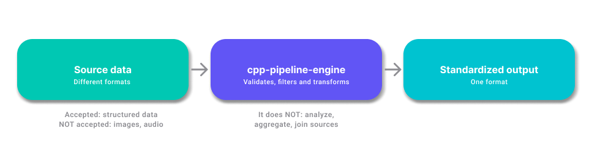
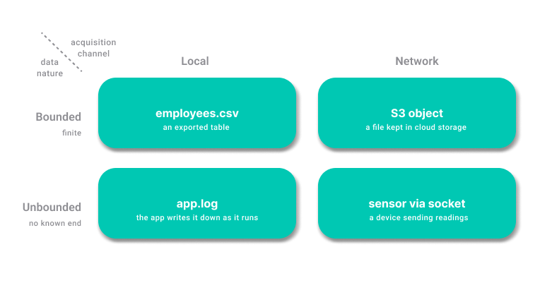
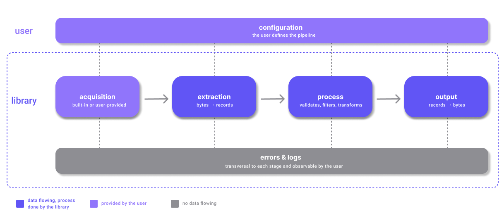
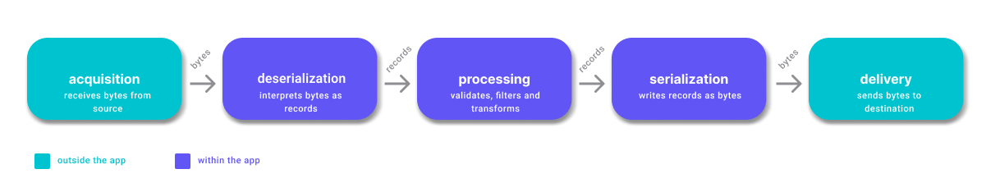

# Shared conceptual model

This document describes what the tool does, in four stages from the most general to the most detailed, and closes by naming the architectural pattern they form. It derives from [architectural-drivers.md](architectural-drivers.md) and provides the shared vocabulary used in [decisions-backlog.md](decisions-backlog.md).

## Stage 0 — Context

Source data arrives in different formats; the library validates, filters and transforms it and produces homogeneous, normalized output for other tools to consume. 

## Stage 1 — Characterizing the input

Two independent axes: the acquisition channel (local or network) and the nature of the data (bounded or unbounded). A bounded dataset has a known, fixed size and does not grow over time; an unbounded one grows while it is being read. All four combinations exist, so the channel does not determine boundedness. Format (CSV, JSON, log lines) is a third axis, independent of the other two.

## Stage 2 — Inside the library

Four blocks make up the internal flow: `acquisition` obtains the raw bytes, `extraction` turns those bytes into records, `processing` validates, filters and transforms them, and `output` turns records back into bytes. The library ships its own implementations of these blocks, and the user can provide their own.

Two concerns run across the whole flow. `configuration` is the recipe: the user defines the pipeline end to end, once, before any data flows — the library then executes it. `errors & logs` are transversal too: they can arise at any block and are observable from outside the library.

## Stage 3 — Responsibilities

The blocks of the previous stage are opened here into five responsibilities: `extraction` is renamed `deserialization`, and `output` splits into `serialization` and `delivery`.

A *record* is a single entry made up of named fields: one row of a CSV, one JSON object, one parsed log line.

Two of the five responsibilities sit outside the application — `acquisition`, which reaches out to an origin for bytes, and `delivery`, which leaves bytes at a destination. The three in between — `deserialization`, `processing`, `serialization` — stay within the application and never touch files, sockets or buckets.

| Responsibility | What it does |
|---|---|
| Acquisition | obtains bytes from an origin |
| Deserialization | interprets those bytes as records |
| Processing | validates, filters and transforms records |
| Serialization | writes records back as bytes |
| Delivery | leaves those bytes at a destination |

Two consequences:

- A record only exists between deserialization and serialization. Everywhere else the data is bytes. This bounds the scope of the data model decision.
- Acquisition and delivery are symmetrical: they are the only two responsibilities that reach outside the application, one to obtain bytes and one to hand them off.

## Architectural pattern

Independent stages, each with a single function, chained by the data passing from one to the next: this shape is the [Pipe and Filter](https://www.geeksforgeeks.org/system-design/pipe-and-filter-architecture-system-design/) pattern. ETL is one of its use cases, alongside Unix pipelines and compilers.

