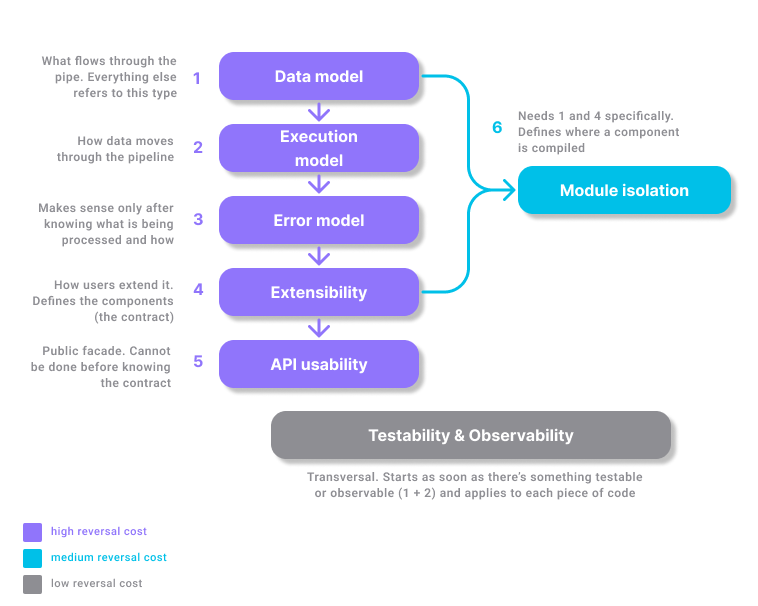

# Decisions (ADRs) backlog

This backlog maps the architectural drivers (see `architectural-drivers.md`) to the set of significant design decisions the project needs to make. Decisions are grouped by topic rather than by driver, since a single decision can respond to more than one driver, and a single driver can generate more than one decision. Each entry lists its originating driver(s) or section(s), plus a short description of the concrete decision it covers. No decision is resolved here: each one will later become its own ADR, numbered once the order of work is set.

## Data model

### Conceptual level

See [conceptual model](conceptual-model.md) for what a *record* is. What it is made of in the type system is decided at the logical level below.

### Logical level
Going one level deeper, from functional drivers 2 and 3 we can derive that a record cannot be static-generic (no templates): the user must be able to choose among different data types at runtime, without recompiling (driver 3). This requires some form of dynamically-resolved type: `std::variant` (closed set), `std::any` (open type-erasure), or polymorphic inheritance.

### Physical level

**Open:** how this dynamic type stores its data internally (map-based vs. vector-based field storage, for example). *Deferred to implementation, not needed to make the data model decision itself.*

## Execution model
Functional driver 5 states that the library must be able to handle unbounded or arbitrarily large data. The use cases include logs and sensor streams that, in principle, never end. This means the incoming data cannot be assumed to fit in memory as a whole. The library needs to decide how many records are alive in memory at any given time: load the full dataset before processing (batch) vs. process one record at a time as it arrives (streaming, pull-based).

The [Pipe and Filter](https://www.geeksforgeeks.org/system-design/pipe-and-filter-architecture-system-design/) pattern lists performance overhead and latency among its known drawbacks, since data moves from stage to stage. Whether that cost is acceptable here is part of this decision.

## Error modeling & handling
As the project's context highlights, this is meant to be a production-ready deliverable, meaning it will run against real files, which will very likely contain inconsistencies: misspelled fields, corrupted rows, missing separators, files that don't exist, etc. (Scope also lists CSV, JSON and sensor messages as expected input sources, and driver 5 adds logs to that list, all notoriously imperfect in practice.)

At least two different classes of error need to be distinguished (not yet decided which policy applies to which, deferred to the dedicated ADR):

- **Configuration errors**: e.g. the input file doesn't exist, the pipeline has no sink. These look like programming mistakes, not data problems.
- **Data errors**: e.g. a single row is corrupted or has the wrong type in a field. These are expected in production, and the pipeline needs some policy for them (stop everything? skip the row? route it elsewhere for later inspection?).

### Error modeling
**Open:** how each error class is represented in the type system (exceptions vs. some `Result`-like return type). *Not resolved here, this document only scopes the question.*

### Error handling
**Open:** what runtime behavior each error class triggers (fail fast vs. skip vs. route to a separate destination). *Not resolved here, this document only scopes the question.*

## Extensibility
Functional drivers 1 and 3, together with quality attribute 1 (extensibility), define decoupling as the core design principle here. Driver 1 lets the user add their own components for the data types they need in their own workflow. Driver 3 lets them compose those (and the library's own) components into a pipeline at runtime, without recompiling, via configuration.

This is about how a user adds a brand new component, not about isolating heavy dependencies (see Module isolation below).

**Open:** does the extension point hand over bytes or already-formed records? This determines whether acquisition and deserialization are one contract or two. *Not resolved here, this document only scopes the question.*

**Open:** is cutting the byte stream into record-sized chunks part of deserialization, or a responsibility of its own that comes before it? Unbounded input cannot wait for the end of the stream to be split. *Not resolved here, this document only scopes the question.*

## API usability
From quality attribute 3. The design must put the user first: the heaviest part of the work happens backstage, so the user only configures what's strictly necessary. The interface should make common mistakes hard to make. Configuration validation happens in one single place before anything runs. Components ship with sensible defaults that the user can override, which also double as usage examples.

**Open:** who decides the input format (CSV, JSON, log lines): the user at configuration time, or the tool by inspecting the data? Not every input is a file with an extension to rely on. *Not resolved here, this document only scopes the question.*

**Open:** when a format allows more than one possible cut (a JSON array read as one record or as many), who decides: the user at configuration time, or the tool at run-time? *Not resolved here, this document only scopes the question.*

## Module isolation
Functional driver 4, together with the constraint that AWS integration will arrive in later stages, make this decision straightforward: the library's components must be built as separate, independently buildable modules, and heavy dependencies must be optional. In particular the AWS SDK, which is heavy enough to slow down compilation and increase the footprint for users who don't need it.

## Testability
From quality attributes 2 (testability) and 1 (extensibility). Quality attribute 2 states that testability is made cheap by the decoupling that extensibility already demands. The testing tools themselves are already fixed by the project's constraints (GoogleTest/GMock). What this category decides is the shape components must have for those tools to work well against them: internal interfaces must stay minimal, so the surface to mock stays small and every use case (error policies, call order, edge cases) can be tested in isolation without touching disk or network.

## Dependency sequencing

### Reversal cost

| Category | Reversal cost | Why |
|---|---|---|
| Data model | High | It's the type flowing through the entire public API; changing it breaks interfaces, third-party components, and the error model. |
| Execution model | High | The stage contracts encode whether records arrive one at a time or in bulk; changing that later reshapes the contracts, not just the internal implementation. |
| Error modeling & handling | High | Swapping Result<T> for exceptions (or vice versa) touches all code, including third-party components already written against it. |
| Extensibility | High | Defines the contract any component (own or third-party) must satisfy; changing it breaks everything already written against that contract. |
| API usability | High | It's the public-facing surface; changing it directly inconveniences users already relying on it. |
| Module isolation | Medium | Reversible (it's a matter of directory/target organization), but costly if delayed: reorganizing existing modules and CMakeLists takes real work, though it doesn't break usage contracts. |
| Testability | Low | Not a decision with content of its own — it's a consequence of how the other decisions are designed. Can be applied at any point with no real reversal cost. |

### Dependencies graph

  

1. **Data model** — no dependencies. Defines the type that flows through the pipeline; every other decision references it.
2. **Execution model** — depends on (1). You can't decide how data moves without first knowing what that data is.
3. **Error modeling & handling** — depends on (2). Per-record error policies (skip/fail/route) only make sense once records are known to be processed one at a time (streaming). A batch model would frame the question differently.
4. **Extensibility** — depends on (1), (2), (3). A user-defined component must satisfy one contract, and that contract already bundles: what it receives (1), when it's called (2), and what an error looks like (3).
5. **API usability** — depends on (4). The public-facing builder can only be designed once the underlying components and their contract already exist.
6. **Module isolation** — depends on (1) and (4) specifically, not (2) or (3). You need to know what kinds of components exist (1) and how a user adds their own (4) to decide which compilation module each one belongs to. Execution model and error handling don't affect where a component physically lives.

> **Testability** is not part of the sequence — it's a transversal practice. It starts as soon as something testable exists (once 1 and 2 have a first shape) and re-applies to every piece of code added afterward, rather than occupying a fixed position.